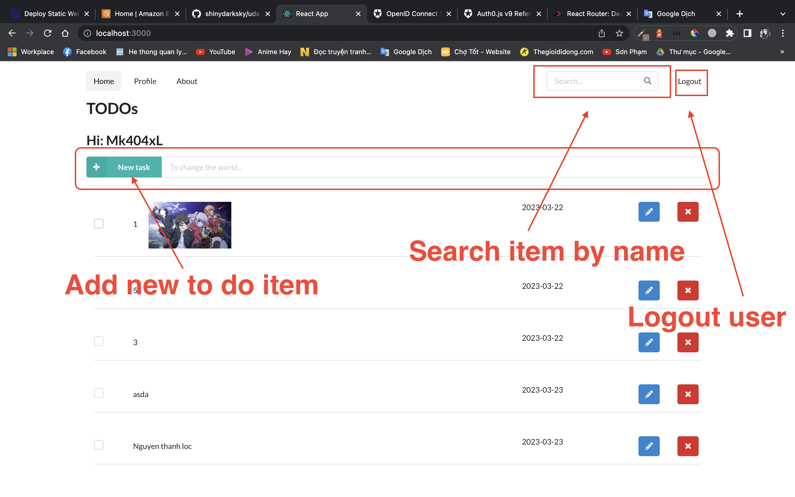
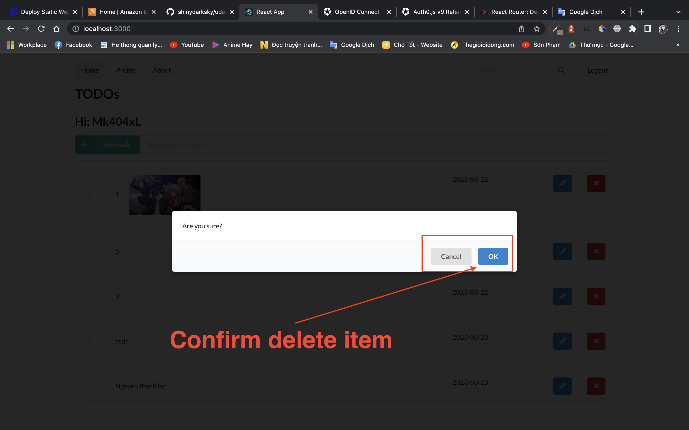
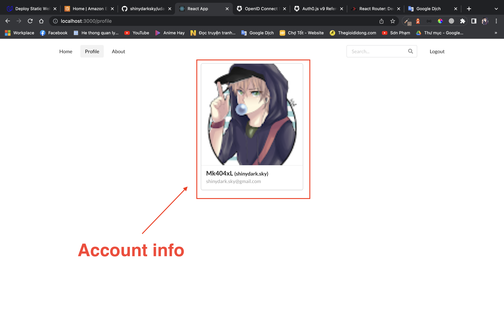

<!-- ~/.aws/credentials
~/.aws/config -->

### New feature:
- Login by Auth0.
- Keep user profile when reloading browser
- Searching todo item
- Get user profile when you login

#### Api serverless
https://ouxph7pph7.execute-api.us-east-1.amazonaws.com/dev/todos
# udacicy-cloud-developer-project-5
To build this project you need to using old version of NodeJS.
Recommend Node v14.21.3 .

# front-end:
cd client
1. npm i 

2. npm start

http://localhost:3000

cd backnend 
npm i .

export NODE_OPTIONS=--max_old_space_size=8192

serverless deploy --verbose or sls deploy

## Some thing:

### home page 

