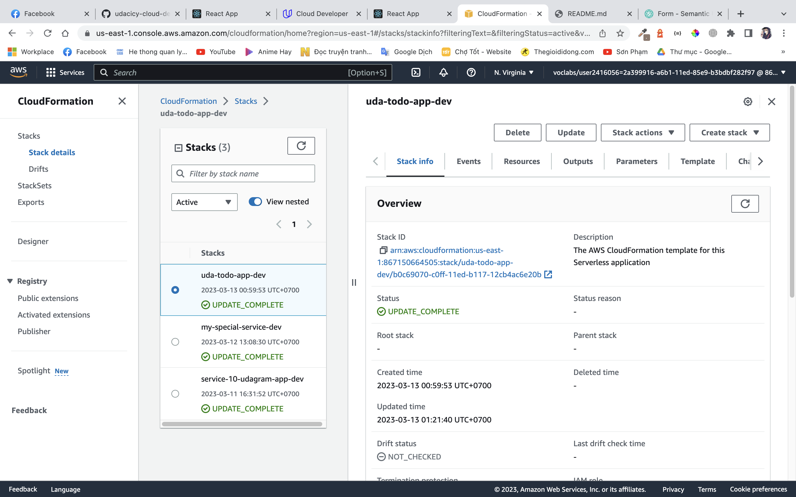
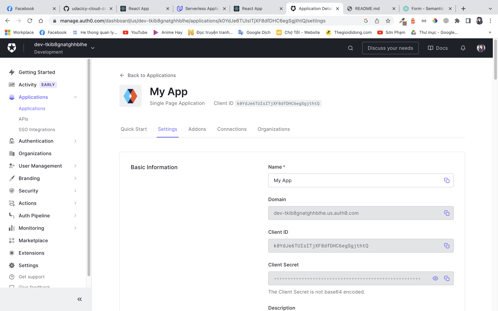
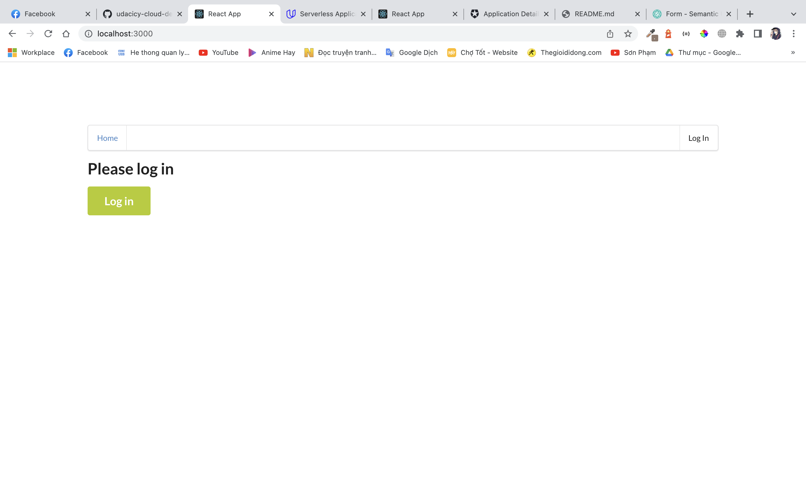
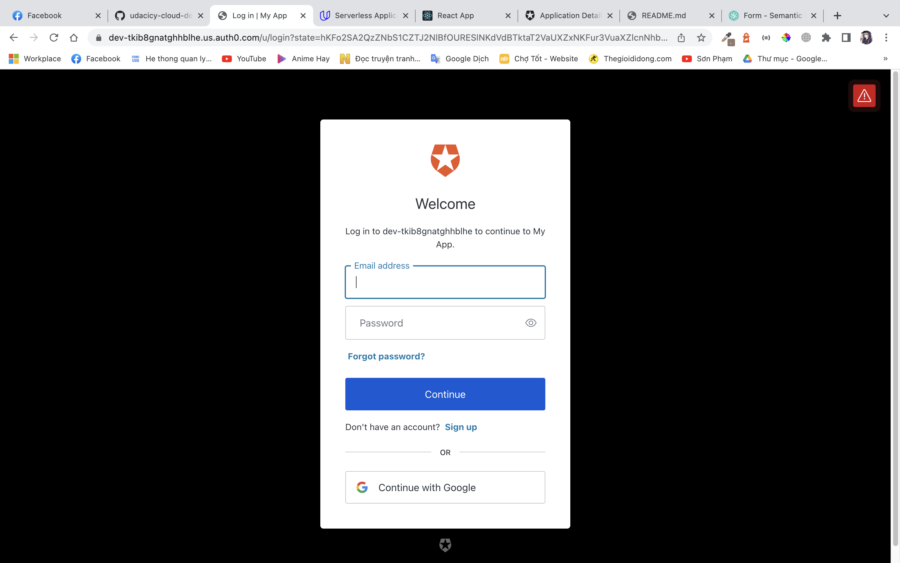
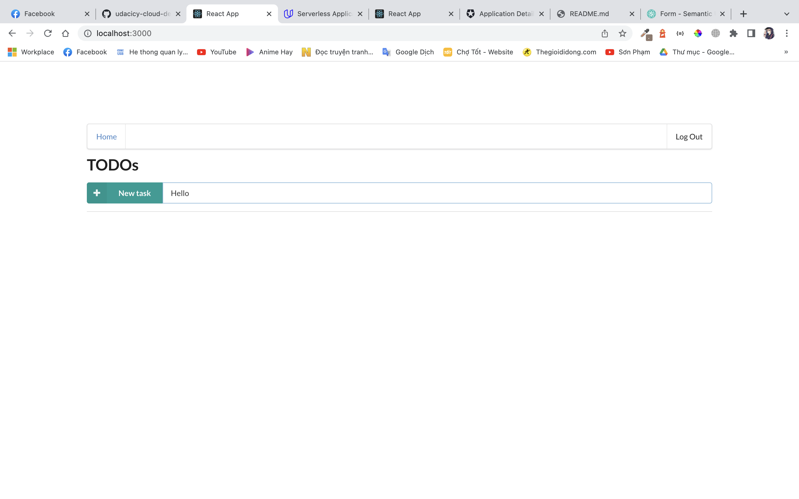
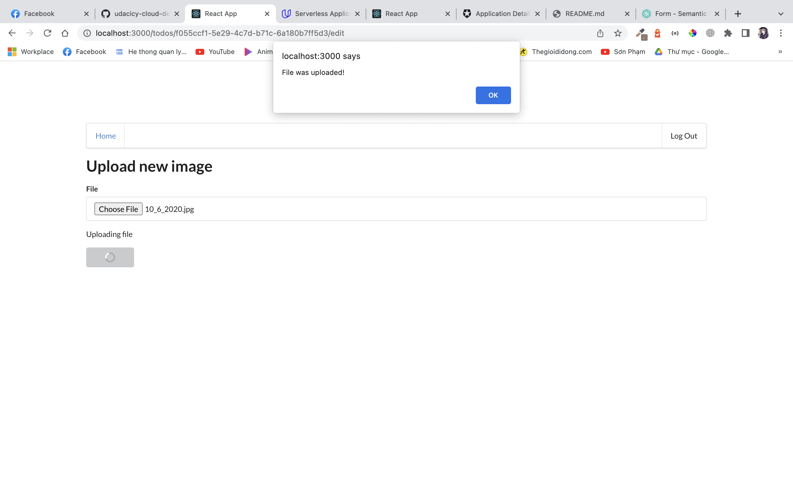
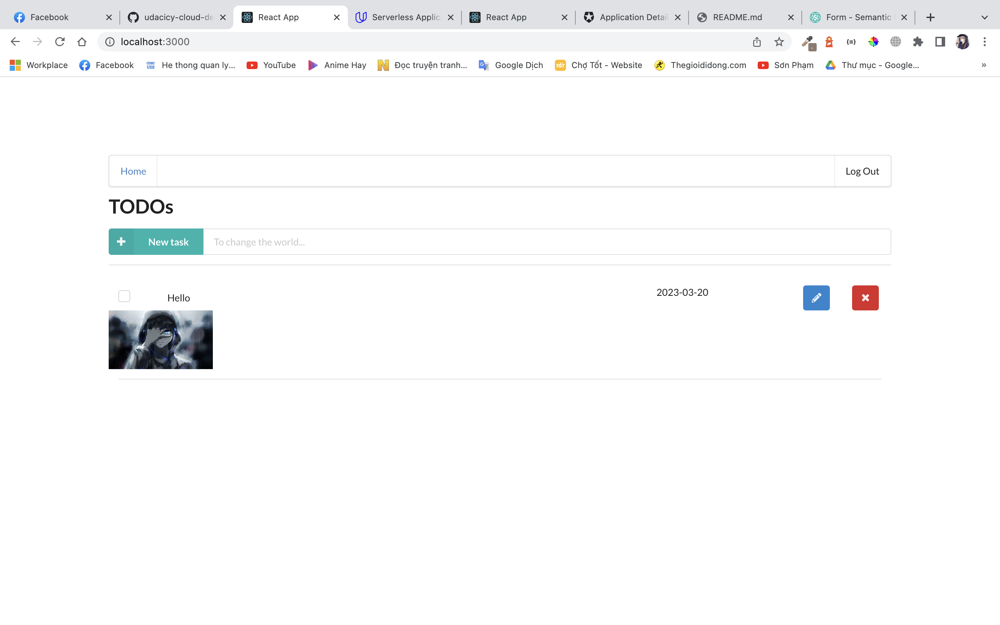

#### config credentials
<!-- ~/.aws/credentials
~/.aws/config -->

# udacicy-cloud-developer-project-4
To build this project you need to using old version of NodeJS.
Recommend Node v14.21.3 .

# front-end:
cd client
1. npm i 

2. npm start

http://localhost:3000

cd backnend 
npm i .

export NODE_OPTIONS=--max_old_space_size=8192

serverless deploy --verbose or sls deploy

## Some thing:

CloudFormation

Auth0

HomePage

Auth0 login page    

Add new item   

Edit item   

Updated item   

